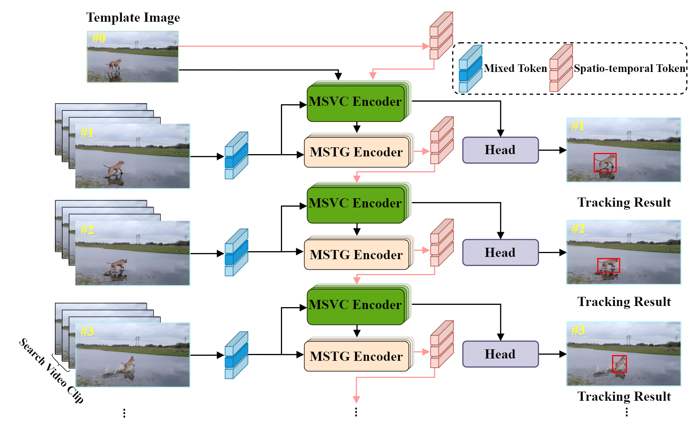

#  - MSTGT

The official implementation for the paper "MSTGT: Multi-Scale Spatio-Temporal Guidance for Visual Tracking".

<p align="center">
  
</p>

Addressing the challenge of target tracking in complex scenarios with limited data samples is a highly significant research endeavor. Nevertheless, most trackers primarily concentrate on intricate model architectures or template updating strategies, overlooking the depth of training sample exploitation and the efficient utilization of spatial-temporal target information. To alleviate the above problem, we propose a novel visual tracking framework tailored for complex scenarios, named MSTGT, which integrates mixed data sampling with multi-scale spatial-temporal guidance. Specifically, we innovatively employ a video sequence sampling and feature mixing strategy to simulate complex scenarios, enhancing the representation of video sequences. Concurrently, our multi-scale visual cue encoder harnesses multi-scale target information to fortify feature representation and cue construction. Furthermore, our multi-scale spatial-temporal guidance encoder, a groundbreaking approach, seamlessly integrates spatial and temporal dimensions with multi-scale information, precisely guiding the prediction of target trajectories. This not only bolsters the handling of intricate motion patterns but also circumvents the need for intricate online updating strategies. Extensive experiments on GOT-10K, LaSOT, LaSOText, TrackingNet, UAV123, and OTB-100 datasets, conclusively demonstrate that MSTGT achieves SOTA performance at real-time speeds by effectively fusing scarce training samples with multi-scale spatial-temporal information.


## Install the environment
```
conda create -n MSTGT python=3.8
conda activate MSTGT
bash install.sh
```


## Data Preparation
Put the tracking datasets in ./data. It should look like:
   ```
   ${PROJECT_ROOT}
    -- data
        -- lasot
            |-- airplane
            |-- basketball
            |-- bear
            ...
        -- got10k
            |-- test
            |-- train
            |-- val
        -- coco
            |-- annotations
            |-- images
        -- trackingnet
            |-- TRAIN_0
            |-- TRAIN_1
            ...
            |-- TRAIN_11
            |-- TEST
   ```


## Set project paths
Run the following command to set paths for this project
```
python tracking/create_default_local_file.py --workspace_dir . --data_dir ./data --save_dir ./output
```
After running this command, you can also modify paths by editing these two files
```
lib/train/admin/local.py  # paths about training
lib/test/evaluation/local.py  # paths about testing
```


## Training
Download pre-trained [MAE HiViT-Base weights](https://drive.google.com/file/d/1VZQz4buhlepZ5akTcEvrA3a_nxsQZ8eQ/view?usp=share_link) and put it under `$PROJECT_ROOT$/pretrained_networks` (different pretrained models can also be used, see [MAE](https://github.com/facebookresearch/mae) for more details).

```
python tracking/train.py \
--script MSTGT --config MSTGT-full-256 \
--save_dir ./output \
--mode multiple --nproc_per_node 2 \
--use_wandb 0
```

Replace `--config` with the desired model config under `experiments/MSTGT`.

We use [wandb](https://github.com/wandb/client) to record detailed training logs, in case you don't want to use wandb, set `--use_wandb 0`.


## Test and Evaluation

- LaSOT or other off-line evaluated benchmarks (modify `--dataset` correspondingly)
```
python tracking/test.py --tracker_param MSTGT-full-256 --dataset lasot --threads 8 --num_gpus 2
python tracking/analysis_results.py # need to modify tracker configs and names
```
- GOT10K-test
```
python tracking/test.py  --tracker_param MSTGT-full-256 --dataset got10k --threads 8 --num_gpus 2
```
- TrackingNet
```
python tracking/test.py  --tracker_param MSTGT-full-256 --dataset trackingnet --threads 8 --num_gpus 2
```


## Test FLOPs, and Speed
*Note:* The speeds reported in our paper were tested on a single RTX2080Ti GPU.

```
python tracking/profile_model.py --script MSTGT --config MSTGT-full-256
```


## Acknowledgments
* Thanks for the [OSTrack](https://github.com/botaoye/OSTrack) and [PyTracking](https://github.com/visionml/pytracking) library, which helps us to quickly implement our ideas.


## Citation
If our work is useful for your research, please consider citing:

```Bibtex
@inproceedings{
}
```